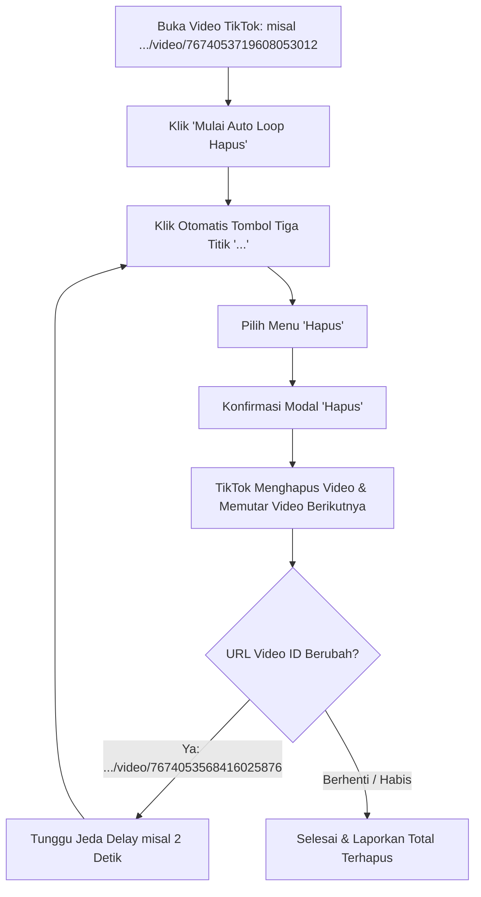

# 🎬 TikTok Auto Video Deleter (Chrome Extension Manifest V3)

Ekstensi Google Chrome canggih untuk menghapus video TikTok secara otomatis satu per satu atau secara massal/beruntun (*Batch Auto-Next Deletion*).

---

## ✨ Fitur Utama

1. **In-Page Floating Overlay (Widget Melayang)**:
   - Panel kontrol interaktif langsung di atas halaman video TikTok (`https://www.tiktok.com/@username/video/...`).
   - Dapat digeser (*draggable*) ke mana saja di layar.
   - Tombol minimize/expand agar tidak menghalangi tampilan video.
2. **Dual Mode Penghapusan**:
   - **🗑️ Hapus 1 Video**: Menghapus video aktif saat ini dengan 1 klik.
   - **▶️ Auto Loop Hapus**: Menghapus video beruntun secara otomatis. Saat TikTok otomatis memutar video selanjutnya dan URL ID video berubah, ekstensi akan melanjutkan penghapusan hingga selesai atau dihentikan.
3. **Smart Multi-Strategy DOM Engine**:
   - Mendeteksi tombol opsi titik tiga `...` secara otomatis.
   - Mendeteksi opsi menu *Hapus* / *Delete*.
   - Mengonfirmasi modal popup *Anda yakin ingin menghapus video ini?*.
   - Mendeteksi notifikasi toast *Dihapus* & perubahan URL Video ID.
4. **Safety & Rate-Limit Protection**:
   - Pengaturan jeda waktu (*Delay*) antar video (misal 2 detik).
   - Pengaturan kuota maksimal (*Max Limit*), misal hapus 10 video lalu stop otomatis.
   - Tombol Darurat *STOP / HENTIKAN* kapan saja.
5. **Dashboard Popup Modern**:
   - Desain gelap (*Glassmorphic Dark Theme*) beraksen TikTok Neon (#FE2C55 & #25F4EE).
   - Counter video terhapus (Sesi ini & Total seumur hidup).
   - Badge notifikasi counter pada ikon ekstensi Chrome.

---

## 📸 Alur Kerja Ekstensi (Workflow)



---

## 🚀 Cara Install di Google Chrome (Developer Mode)

1. Buka browser **Google Chrome**.
2. Masuk ke halaman ekstensi dengan mengetik:
   ```
   chrome://extensions/
   ```
   pada address bar.
3. Aktifkan **Developer mode** (Mode Pengembang) di pojok kanan atas.
4. Klik tombol **Load unpacked** (Muat yang belum dibongkar) di pojok kiri atas.
5. Pilih folder proyek ini:
   ```
   c:\Users\NCN0C\Downloads\extension hapus tiktok
   ```
6. Ekstensi **TikTok Auto Video Deleter** berhasil terpasang! 🎉
7. Sematkan (*Pin*) ekstensi pada toolbar Chrome untuk akses cepat.

---

## 📖 Cara Penggunaan

1. Buka akun TikTok Anda dan masuk ke salah satu video yang ingin dihapus (misal: `https://www.tiktok.com/@username/video/1234567890`).
2. Widget melayang **TikTok Auto Deleter** akan langsung muncul di pojok kanan atas halaman.
3. Atur **Jeda Antar Video** (rekomendasi: 2 - 3 detik agar aman).
4. Klik tombol **▶️ Mulai Auto Loop Hapus**.
5. Ekstensi akan otomatis:
   - Menekan tombol `...`
   - Memilih menu `Hapus`
   - Mengonfirmasi modal dialog `Hapus`
   - Mendeteksi saat video terhapus dan TikTok beralih ke video berikutnya (`ID URL berubah`)
   - Mengulang proses hingga video habis atau Anda menekan tombol **⏹️ HENTIKAN**.

---

## 🛠️ Struktur File Ekstensi

```
extension hapus tiktok/
├── manifest.json            # Konfigurasi Manifest V3
├── background.js            # Service worker (penyimpanan & badge)
├── content.js               # Mesin otomasi & pendeteksi DOM TikTok
├── content.css              # Tampilan visual widget melayang
├── popup/
│   ├── popup.html          # UI Dashboard popup ekstensi
│   ├── popup.css           # Styling dark mode popup
│   └── popup.js            # Controller interaksi popup
├── icons/
│   ├── icon-16.png         # Icon 16x16 px
│   ├── icon-32.png         # Icon 32x32 px
│   ├── icon-48.png         # Icon 48x48 px
│   └── icon-128.png        # Icon 128x128 px
├── scripts/
│   └── generate_icons.js   # Generator icon PNG
└── README.md                # Dokumentasi panduan lengkap
```

---

## 🌐 Deploy ke GitHub

Untuk mengunggah ekstensi ini ke akun GitHub Anda:

```bash
# Inisialisasi Git
git init

# Tambahkan semua file
git add .

# Buat commit pertama
git commit -m "feat: initial commit TikTok auto video deleter extension manifest v3"

# Buat branch main
git branch -M main

# Hubungkan ke repository GitHub Anda (ganti URL dengan repo Anda)
git remote add origin https://github.com/USERNAME/tiktok-auto-video-deleter.git

# Push ke GitHub
git push -u origin main
```

---

## ⚠️ Catatan Keamanan
- Pastikan Anda sudah login ke akun TikTok pemilik video tersebut sebelum menjalankan ekstensi.
- Gunakan jeda wajar (2-3 detik) untuk menjaga stabilitas koneksi TikTok web.
- Anda dapat menghentikan proses kapan saja dengan mengklik tombol **HENTIKAN AUTO LOOP**.
